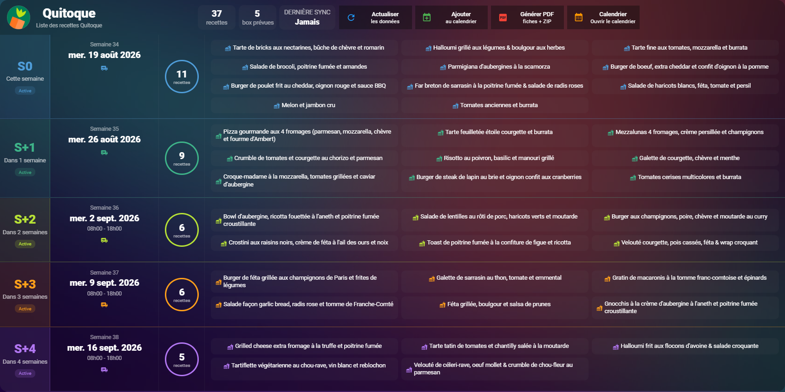

# 🥕 Dashboard Quitoque pour Home Assistant

Dashboard Home Assistant dédié à l'intégration **Quitoque**, permettant de visualiser facilement les prochaines livraisons et les recettes associées.

Le dashboard affiche les box de **cette semaine jusqu'à S+4**, avec les recettes, les dates et créneaux de livraison ainsi que plusieurs actions liées à l'intégration dans une présentation adaptée à un affichage plein écran.


																	

---

## 📸 Aperçu

Ajoutez une capture du dashboard dans le dossier `images` :

```markdown

```

---

## ✨ Fonctionnalités

Le dashboard permet de visualiser en un coup d'œil :

- 📦 les livraisons Quitoque de **S0 à S+4**
- 📅 la date de chaque livraison
- 🕐 le créneau horaire de livraison lorsqu'il est disponible
- 🍽️ le nombre de recettes de chaque semaine
- 🥘 la liste des recettes
- 📊 le nombre total de recettes disponibles
- 📦 le nombre de box prévues
- 🔄 la date de la dernière synchronisation du calendrier

Chaque semaine possède sa propre couleur afin de faciliter la lecture du tableau.

### Actions disponibles

Quatre boutons sont disponibles dans le bandeau supérieur :

| Bouton | Fonction |
|---|---|
| 🔄 **Actualiser** | Récupère immédiatement les dernières données Quitoque |
| 📅 **Ajouter** | Ajoute au calendrier les nouvelles semaines disponibles |
| 📄 **Générer PDF** | Génère les fiches recettes PDF ainsi que l'archive ZIP |
| 🗓️ **Calendrier** | Ouvre le calendrier Home Assistant ou une URL personnalisée |

---

# 📋 Prérequis

## Home Assistant

Ce dashboard est conçu pour être utilisé avec **Home Assistant** et l'intégration personnalisée **Quitoque**.

L'intégration doit être installée et configurée avant d'utiliser le dashboard.

## Cartes Lovelace nécessaires

Le dashboard utilise deux cartes personnalisées :

### Button Card

`custom:button-card`

### Mushroom

`custom:mushroom-template-card`

Ces cartes peuvent être installées facilement depuis **HACS**.

---

# 🚀 Installation

## 1. Installer les cartes nécessaires

Vérifiez que les cartes suivantes sont installées dans Home Assistant :

```text
button-card
Mushroom
```

Rechargez ou redémarrez Home Assistant si nécessaire après leur installation.

---

## 2. Créer le dashboard

Dans Home Assistant :

**Paramètres → Tableaux de bord**

Créez un nouveau tableau de bord ou une nouvelle vue.

Le dashboard est prévu pour fonctionner en mode :

```yaml
panel: true
```

afin d'utiliser toute la largeur disponible.

---

## 3. Copier la configuration

Copiez le contenu du fichier :

```text
quitoque-dashboard.yaml
```

dans votre configuration Lovelace.

Le début de la configuration est :

```yaml
title: Quitoque
path: quitoque
icon: mdi:food-variant
panel: true
```

---

# 🗓️ Bouton Calendrier

Par défaut, le bouton **Calendrier** ouvre directement le calendrier de Home Assistant.

La configuration fournie utilise :

```yaml
tap_action:
  action: url
  url_path: >-
    https://my.home-assistant.io/redirect/calendar
```

Cela rend le bouton directement fonctionnel sans configuration supplémentaire.

## Utiliser un autre calendrier

Vous pouvez remplacer cette URL par celle du calendrier de votre choix.

Recherchez dans le YAML :

```yaml
primary: Calendrier
secondary: Ouvrir le calendrier
```

Puis remplacez :

```yaml
url_path: >-
  https://my.home-assistant.io/redirect/calendar
```

par votre propre URL :

```yaml
url_path: >-
  https://VOTRE-URL
```

Vous pouvez par exemple utiliser :

- Google Calendar ;
- Nextcloud Calendar ;
- Synology Calendar ;
- un calendrier auto-hébergé ;
- toute autre interface Web de votre choix.

---

# 📅 Semaines affichées

Le dashboard affiche cinq semaines :

| Indicateur | Période |
|---|---|
| **S0** | Cette semaine |
| **S+1** | Dans 1 semaine |
| **S+2** | Dans 2 semaines |
| **S+3** | Dans 3 semaines |
| **S+4** | Dans 4 semaines |

Une ligne peut par exemple afficher :

```text
S+2
Dans 2 semaines

Semaine 36
mer. 2 sept. 2026
08h00 - 18h00

6 recettes
```

Les dates utilisent volontairement des noms de jours et de mois abrégés afin de conserver une présentation régulière quelle que soit la date.

---

# 🎨 Couleurs

Une couleur différente est utilisée pour chaque semaine :

| Semaine | Couleur |
|---|---|
| **S0** | 🔵 Bleu |
| **S+1** | 🟢 Vert |
| **S+2** | 🟢 Vert citron |
| **S+3** | 🟠 Orange |
| **S+4** | 🟣 Violet |

Ces couleurs sont utilisées pour les séparateurs, les icônes, l'état de la box et le compteur de recettes.

---

# 🖥️ Affichage dynamique

Le dashboard utilise une grille CSS dynamique pour répartir l'espace entre :

- le logo et le titre Quitoque ;
- les statistiques ;
- les quatre boutons d'action.

La configuration utilisée est :

```yaml
grid-template-columns: minmax(280px, 1fr) 330px minmax(0, 1.6fr)
```

La zone des boutons utilise également une grille de quatre colonnes afin que les quatre boutons conservent la même largeur.

La largeur du bandeau s'adapte ainsi automatiquement à la largeur disponible.

---

# 🔧 Entités utilisées

Les `entity_id` Home Assistant ne changent pas automatiquement lorsque la langue de Home Assistant est modifiée.

Selon la version de l'intégration utilisée ou la date à laquelle les entités ont été créées, un utilisateur peut donc posséder des `entity_id` différents.

Pour faciliter le partage du dashboard, celui-ci recherche automatiquement plusieurs variantes connues des entités.

> [!NOTE]
> Il ne s'agit pas d'une détection de la langue de Home Assistant.  
> Le dashboard teste les différents `entity_id` connus et utilise automatiquement le premier qui existe.

---

## 📦 Livraisons

| Entité française | Entité anglaise |
|---|---|
| `sensor.quitoque_livraison_cette_semaine` | `sensor.quitoque_delivery_this_week` |
| `sensor.quitoque_livraison_dans_1_semaine` | `sensor.quitoque_delivery_in_1_week` |
| `sensor.quitoque_livraison_dans_2_semaines` | `sensor.quitoque_delivery_in_2_weeks` |
| `sensor.quitoque_livraison_dans_3_semaines` | `sensor.quitoque_delivery_in_3_weeks` |
| `sensor.quitoque_livraison_dans_4_semaines` | `sensor.quitoque_delivery_in_4_weeks` |

Pour **S0**, le dashboard reconnaît également l'ancienne variante :

```text
sensor.quitoque_delivery_in_0_weeks
```

---

## 🍽️ Nombre de recettes

| Entité française | Entité anglaise |
|---|---|
| `sensor.quitoque_nombre_de_recettes_cette_semaine` | `sensor.quitoque_recipes_this_week` |
| `sensor.quitoque_nombre_de_recettes_dans_1_semaine` | `sensor.quitoque_recipes_in_1_week` |
| `sensor.quitoque_nombre_de_recettes_dans_2_semaines` | `sensor.quitoque_recipes_in_2_weeks` |
| `sensor.quitoque_nombre_de_recettes_dans_3_semaines` | `sensor.quitoque_recipes_in_3_weeks` |
| `sensor.quitoque_nombre_de_recettes_dans_4_semaines` | `sensor.quitoque_recipes_in_4_weeks` |

Pour **S0**, le dashboard reconnaît également :

```text
sensor.quitoque_recipes_in_0_weeks
```

---

## 🔄 Dernière synchronisation du calendrier

| Entité française | Entité anglaise |
|---|---|
| `sensor.quitoque_derniere_synchronisation_du_calendrier` | `sensor.quitoque_last_calendar_synchronization` |

---

## 🔘 Bouton Actualiser

Le dashboard recherche automatiquement les entités suivantes :

| Entité anglaise | Entité française |
|---|---|
| `button.quitoque_refresh` | `button.quitoque_actualiser` |

---

## 📅 Bouton Ajouter au calendrier

| Entité anglaise | Entité française |
|---|---|
| `button.quitoque_add_recipes_to_calendar` | `button.quitoque_ajouter_les_recettes_au_calendrier` |

Le dashboard reconnaît également :

```text
button.quitoque_sync_calendar
```

---

## 📄 Bouton Générer les PDF

| Entité anglaise | Entité française |
|---|---|
| `button.quitoque_generate_and_download_pdfs` | `button.quitoque_generer_et_telecharger_les_pdf` |

Le dashboard recherche également les variantes prévues dans sa configuration :

```text
button.quitoque_generer_les_pdf_recette
button.quitoque_export_pdf
```

---

# 🔎 Comment fonctionne la détection des entités ?

Pour les capteurs, le dashboard utilise une fonction JavaScript de ce type :

```javascript
const first = (...ids) =>
  ids.map(id => states[id]).find(e => e !== undefined);
```

Il teste donc successivement plusieurs `entity_id` et conserve automatiquement celui qui existe dans Home Assistant.

Les boutons utilisent le même principe :

```javascript
const ids = [
  'button.quitoque_refresh',
  'button.quitoque_actualiser'
];

return ids.find(id => states[id] !== undefined) || ids[0];
```

Cela permet au même fichier YAML de fonctionner sur plusieurs installations sans demander systématiquement à l'utilisateur de renommer ses entités.

---

# 🖼️ Logo Quitoque

Le dashboard tente de récupérer automatiquement le logo depuis le dépôt de l'intégration :

```text
custom_components/quitoque/brand/icon.png
```

Si cette image ne peut pas être chargée, le dashboard tente d'utiliser l'icône fournie par Home Assistant comme solution de secours.

---

# 🛠️ Personnalisation

Le dashboard peut facilement être adapté.

Vous pouvez notamment modifier :

- l'URL du bouton Calendrier ;
- les couleurs associées aux semaines ;
- les libellés des boutons ;
- les icônes ;
- les dimensions des différentes zones ;
- les tailles de texte.

Les couleurs des semaines sont définies directement dans le tableau JavaScript `weeks`.

---

# ❓ Dépannage

## Le dashboard n'affiche aucune recette

Vérifiez que :

1. l'intégration Quitoque est installée et fonctionne ;
2. une actualisation des données a déjà été effectuée ;
3. les entités Quitoque sont disponibles dans Home Assistant ;
4. les recettes sont présentes dans les attributs des capteurs correspondants.

---

## Les cartes ne s'affichent pas

Vérifiez que **button-card** et **Mushroom** sont correctement installés.

Vous pouvez vérifier leur présence depuis :

**HACS → Frontend**

---

## Un bouton ne fonctionne pas

Dans :

**Outils de développement → États**

recherchez les entités commençant par :

```text
button.quitoque_
```

Puis vérifiez que l'un des `entity_id` prévus par le dashboard existe bien.

---

## Le bouton Calendrier ouvre le mauvais calendrier

Recherchez :

```yaml
url_path:
```

dans le fichier YAML et remplacez l'URL par celle de votre calendrier.

---

# 📁 Structure conseillée du dépôt

Le dashboard peut être publié directement dans le dépôt de l'intégration Quitoque :

```text
quitoque/
│
├── custom_components/
│   └── quitoque/
│       ├── __init__.py
│       ├── api.py
│       ├── button.py
│       ├── sensor.py
│       └── ...
│
├── dashboard/
│   ├── README.md
│   ├── quitoque-dashboard.yaml
│   └── images/
│       └── dashboard.png
│
├── README.md
├── hacs.json
└── ...
```

Le dashboard est **facultatif** : l'intégration Quitoque peut parfaitement être utilisée sans celui-ci.

---

# 🤝 Contributions

Les suggestions, améliorations et corrections sont les bienvenues.

Vous pouvez :

- ouvrir une **Issue** pour signaler un problème ;
- proposer une amélioration ;
- soumettre une **Pull Request**.

---

# ⚠️ Projet non officiel

Ce dashboard est un projet communautaire indépendant.

Il n'est ni développé, ni maintenu, ni officiellement supporté par **Quitoque**.

Les marques, noms et logos appartiennent à leurs propriétaires respectifs.

---

## ❤️ Remerciements

Merci à la communauté **Home Assistant**, aux développeurs de **button-card** et **Mushroom**, ainsi qu'aux utilisateurs qui contribuent aux tests et à l'amélioration de l'intégration Quitoque et de ce dashboard.
